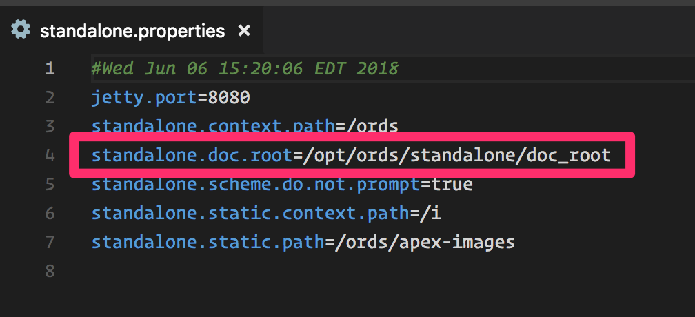
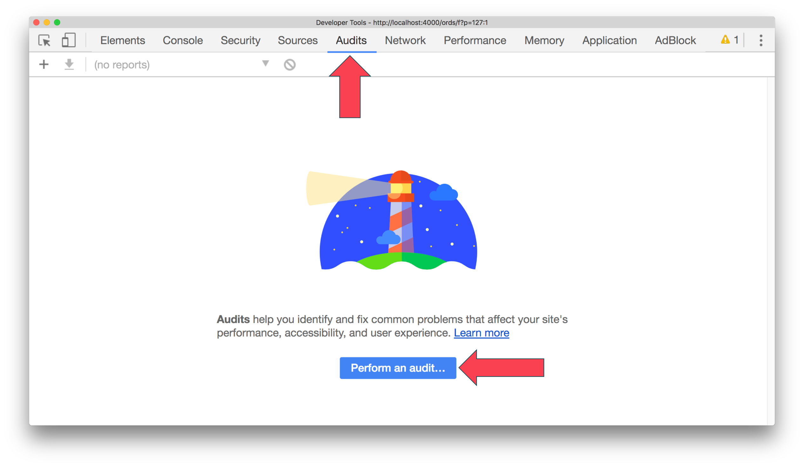
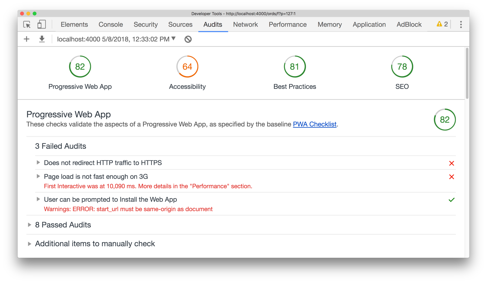
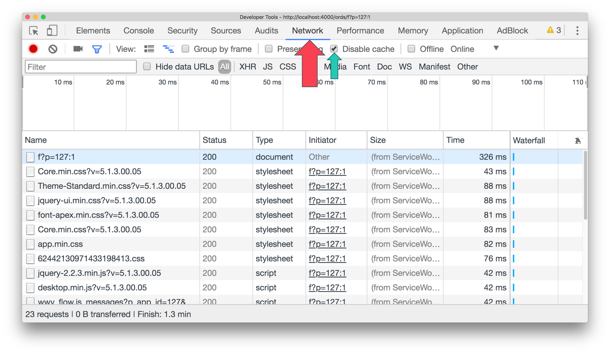

# Part 2: Setup and Development Tips

> This blog post series intends to cover everything there is to know about turning an APEX application into a Progressive Web App.
>
> This documentation is also available [on my blog](https://vmorneau.me/apex-pwa-part2).

## APEX as a PWA: The Complete Guide

* [Part 1: Introducing Progressive Web Apps](./doc/part1.md)
* **Part 2: Setup and Development Tips**
* [Part 3: JavaScript Recap](./doc/part3.md)
* [Part 4: Installing an APEX App into a Mobile Device](./doc/part4.md)
* [Part 5: Using an APEX App Offline](./doc/part5.md)
* [Part 6: Handling Background Sync](./doc/part6.md)
* [Part 7: Sending Push Notifications](./doc/part7.md)
* [Part 8: Final Thoughts](./doc/part8.md)

## Part 2: Table of Content

* [Setup](#setup)
  * [Serving Files From Shared Components](#serving-files-from-shared-components)
  * [Serving Files From the Root](#serving-files-from-the-root)
  * [ORDS Doc Root](#ords-doc-root)
* [Development Tips](#development-tips)
  * [Tip 1: Audit PWA Features](#tip-1-audit-pwa-features)
  * [Tip 2: Dealing with the Cache](#tip-2-dealing-with-the-cache)
  * [Tip 3: Debugging from Mobile](#tip-3-debugging-from-mobile)

---

## Setup

As mentioned in [Part 1](./part1.md), everything we'll be doing in this guide is pure JavaScript and pure APEX. The only setup required for developing a PWA is about placing the static files (JavaScript) at the right location on our server.

I always encourage APEX developers to store static files in the Shared Components. It makes deployment much easier because the files are bundled with the application when it's exported.

### Serving Files From Shared Components

When a file is being server from the Shared Components it uses a public path, relative to your application URL. Example from my development environment:

_URL of my app:_

```html
https://localhost:31810/pls/apex/f?p=1694:1
```

_Reference to my JavaScript file:_

```html
#APP_IMAGES#js/app.js
```

_APEX resolves the reference to my JavaScript file to:_

```html
https://localhost:31810/pls/apex/apex_vmorneau/r/1694/files/static/v1426/js/app.js
```

> Quick analysis from the URL above:
>
> * `https://localhost:31810/` is my domain
> * `apex_vmorneau` is my workspace
> * `1694` is my application ID
> * `/js/app.js` is the location of my file in the Shared Components

This kind of static file placement is good for most cases, but it will not satisfy the PWA requirements. In a PWA, some files need to be served from another location.

### Serving Files From the Root

In [Part 4](./part4.md) and [Part 5](./part5.md) we discuss two particular files:

* `manifest.json`: _enables installation of the APEX application on a device_
* `sw.js` _enables offline usage, synchronization and push notifications_

These two files are at the heart of a PWA and they require a special treatment: **they need to be at the root level of your APEX environment.** Taking the domain example from above (`https://localhost:31810/`), we need these two files to be located there:

* `https://localhost:31810/manifest.json`
* `https://localhost:31810/sw.js`

The browser handles these two files differently than regular JavaScript and JSON files. To function properly, they need to be same origin as the APEX page. If you don't do that, you'll get errors similar to:


### Using ORDS Standalone

On your ORDS instance, locate your `standalone.properties` file. Example:

```bash
/ords/ords-18.1.0/config/standalone/standalone.properties
```

The content of this file should look like:



The value next to `standalone.doc.root` is the location where we need to put `sw.js` and `manifest.json`. More on the content of these two files in [Part 4](./part4.md) and [Part 5](./part5.md).

### Using Glassfish

On Glassfish, we want to store our files in `<domain path>/docroot`.

An example would be: `/opt/glassfish4/glassfish/domains/domain18/docroot`.

## Development Tips

I find Chrome to the best browser for developing a PWA because of its developer tools features. In this guide, I'll be using Chrome and it's important that I share a few tips, so you can optimize your PWA development experience.

### Tip 1: Audit PWA Features

Chrome's developer tools allows to audit your application and give to a score of PWA features coverage. At any point in your development, you can go to the **Audits** tab and click on **Perform an audit**



This tool actually gives a score to other areas of web development, such as Accessibility, Best Practices, SEO, and more. But right now we’ll focus on the PWA part.



### Tip 2: Dealing with the Cache

As you are adding new JavaScript to your PWA, you might want to know about:

1. Disabling the cache in your browser. By keeping the cache enabled while you are pushing new code, you will never get to see your changes. The cache mechanisms we will cover in [Part 5: Using an APEX App Offline](./doc/part5.md) makes sense for production environments.
  

2. Simulating going offline to test your app without connectivity. You can also turn off your Wi-Fi.
  

### Tip 3: Debugging from Mobile

It's safe to say that most PWA would be used on mobile devices, so it becomes increasingly important to test your APEX application on a mobile device before rolling it out to your users. _This tip is not directly related to the development of PWA, but still useful nonetheless._

We can simulate a mobile view on Chrome developer tools:


This is good in most cases, but it's just a simulation and I prefer activating the dev tool right from my mobile device.

In Chrome, we can do this by connecting our mobile device to our computer using a USB cable, then by going to the **Remote Devices** tab of the developer tools.


If it’s connected properly, should should your mobile device there, and it will start mirroring what you’re doing. In other words, you're browsing and testing from the mobile device, but debugging from the desktop. Best of both worlds.

---

At this point, we have fully established the ground work for developing a PWA. Before diving into the PWA features, let's review some important JavaScript concepts in [Part 3: JavaScript Recap](./doc/part3.md). If you're already comfortable with JavaScript _Promises_, _Async_ and _Await_, head to [Part 4: Installing an APEX App into a Mobile Device](./doc/part4.md), where we will tackle the first PWA feature.

_Think this documentation can be enhanced? Please open a pull request and fix it!_
