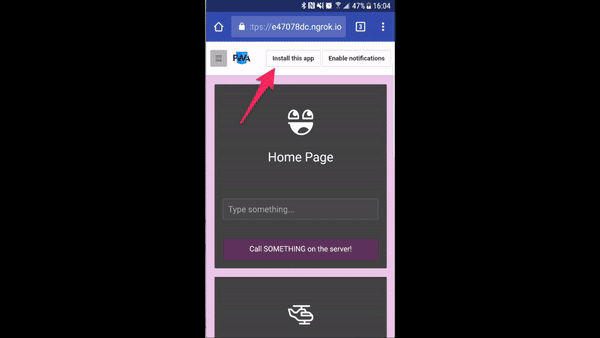
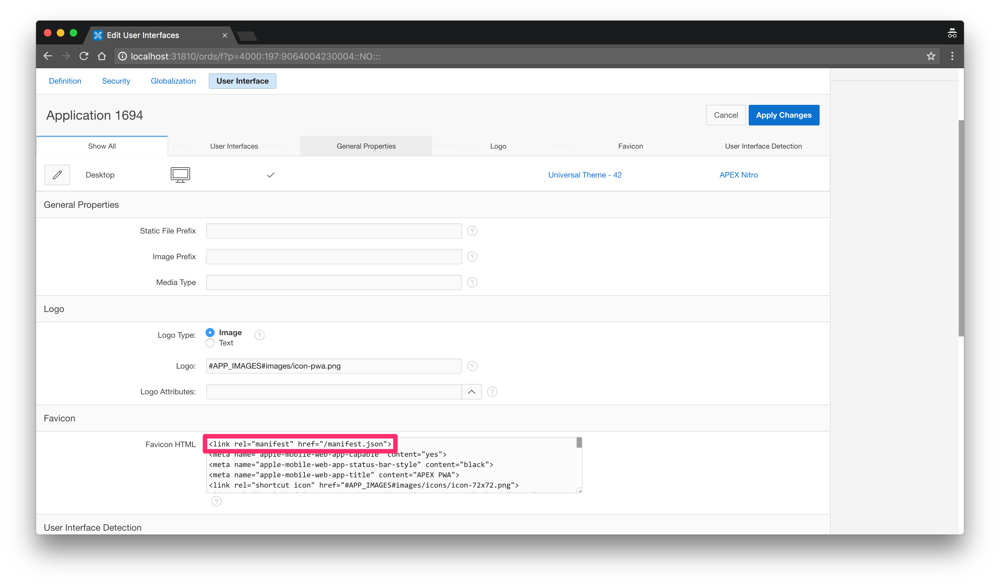
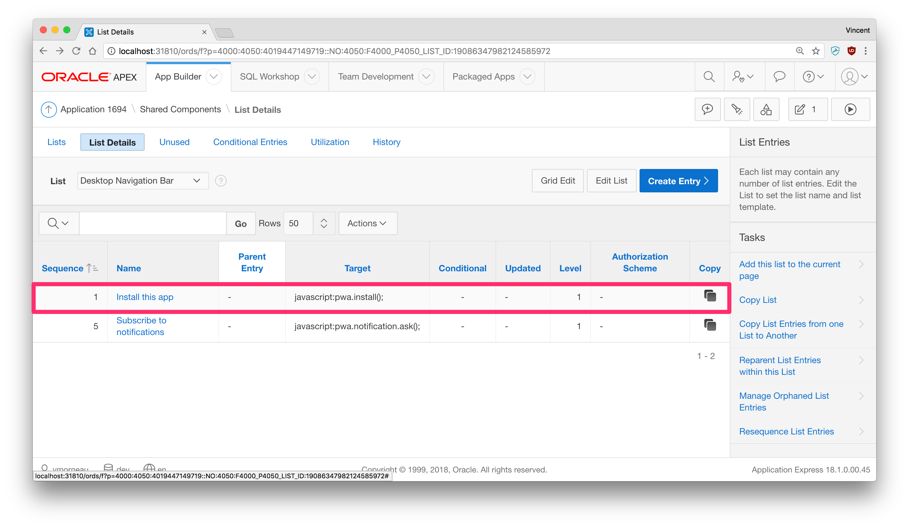
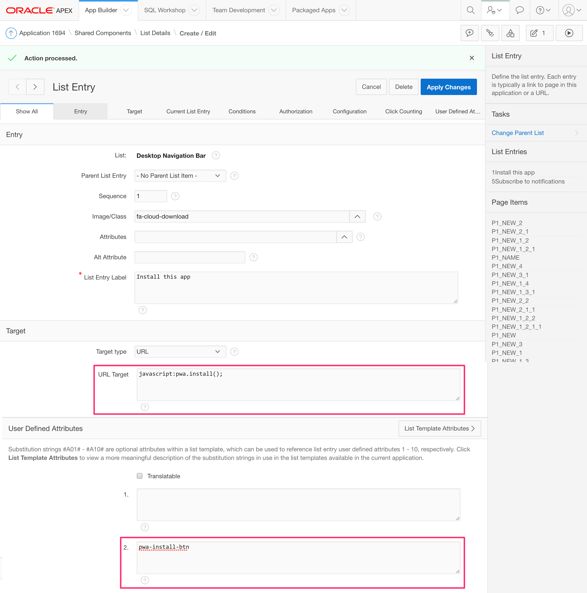

# Part 4: Installing an APEX App into a Mobile Device

> This blog post series intends to cover everything there is to know about turning an APEX application into a Progressive Web App.
>
> This documentation is also available [on my blog](https://vmorneau.me/apex-pwa-part4).

## APEX as a PWA: The Complete Guide

* [Part 1: Introducing Progressive Web Apps](./doc/part1.md)
* [Part 2: Setup and Development Tips](./doc/part2.md)
* [Part 3: JavaScript Recap](./doc/part3.md)
* **Part 4: Installing an APEX App into a Mobile Device**
* [Part 5: Using an APEX App Offline](./doc/part5.md)
* [Part 6: Handling Background Sync](./doc/part6.md)
* [Part 7: Sending Push Notifications](./doc/part7.md)
* [Part 8: Final Thoughts](./doc/part8.md)

## Part 4: Table of Content

* [Characteristics](#characteristics)
* [Architecture](#Architecture)
  * [`manifest.json`](#manifest-json)
  * [Referencing `manifest.json` in APEX](#referencing-manifest-json-in-apex)
  * [Adding an "Install" Button to an APEX App](#adding-an-install-button-to-an-apex-app)
* [Installation Criteria](#understanding-installation-criteria)
* [Installation Prompt](#installation-prompt)
* [Using the Installed App](#using-the-installed-app)

---

## Characteristics

Installing an APEX app on a mobile device is likely the easiest part of building a PWA. It's also a very quick win towards enhancing the mobile experience, because having an APEX application sitting on a mobile device home screen will increase user engagement substantially.

It's always easier to reach for an icon than reaching for a browser bookmark.

We are **not** adding our APEX application to the App Store or Google play. You can use [Cordova](https://cordova.apache.org/) to build an hybrid app like that. A PWA offers an installation button within the app itself. When clicked, the PWA proceeds to install itself on the device, and the button disappears as it's no longer necessary.

Preview:



Observations:

* User clicks on a button `Install this app` in an APEX application
* Confirmation window appears, asking to add this app to the home screen
* User clicks "Add to Home Screen"
* The PWA proceeds to install itself and adds an icon to the home screen
* User clicks the icon on the home screen
* Splash screen appears, like a native app
* APEX application opens in full screen

## Architecture

What we need is to create a special file called `manifest.json`. It **has** to be called `manifest.json` for the browser to recognize the purpose of this file properly.

As indicated in [Part 2](./part2.md), the `manifest.json` file must be located at the root level of the APEX server. Example: `https://localhost:31810/manifest.json`.

### `manifest.json`

Here's an example of a typical `manifest.json` file, [as shown here](https://github.com/vincentmorneau/apex-pwa/blob/master/src/manifest.json).

```json
{
  "name": "APEX as a Progressive Web App",
  "short_name": "APEX PWA",
  "start_url": "http://localhost:31810/ords/f?p=1694:1",
  "display": "standalone",
  "orientation": "portrait-primary",
  "background_color": "#fff",
  "theme_color": "#3f51b5",
  "description": "An example of APEX as a Progressive Web Application",
  "dir": "ltr",
  "lang": "en-US",
  "gcm_sender_id": "103953800507",
  "icons": [
    {
      "src": "./images/icons/icon-72x72.png",
      "type": "image/png",
      "sizes": "72x72"
    },
    {
      "src": "./images/icons/icon-96x96.png",
      "type": "image/png",
      "sizes": "96x96"
    },
    {
      "src": "./images/icons/icon-128x128.png",
      "type": "image/png",
      "sizes": "128x128"
    },
    {
      "src": "./images/icons/icon-144x144.png",
      "type": "image/png",
      "sizes": "144x144"
    },
    {
      "src": "./images/icons/icon-152x152.png",
      "type": "image/png",
      "sizes": "152x152"
    },
    {
      "src": "./images/icons/icon-192x192.png",
      "type": "image/png",
      "sizes": "192x192"
    },
    {
      "src": "./images/icons/icon-384x384.png",
      "type": "image/png",
      "sizes": "384x384"
    },
    {
      "src": "./images/icons/icon-512x512.png",
      "type": "image/png",
      "sizes": "512x512"
    }
  ]
}
```

Property | Description
-- | --
short_name | The name of your application, as shown on the home screen icon
name | The name of your application, as shown on the splash screen
start_url | The URL of your application
display | Controls the UI of your PWA. Options are: `fullscreen`, `standalone`, `minimal-ui`, `browser`. [More info here](https://developers.google.com/web/fundamentals/web-app-manifest/#display)
orientation | Controls the orientation of your PWA. Options are: `any`, `natural`, `landscape`, `landscape-primary`, `landscape-secondary`, `portrait`, `portrait-primary`, `portrait-secondary`
background_color | Controls the background color of your PWA splash screen
theme_color | Controls the color of the mobile task bar while navigating your application (Android)
description | When opening a PWA, the description is shown during the splash screen
dir | Controls the direction of your PWA. Options are : `ltr`, `rtl`
lang | Specifies the `name` and `short_name`. Example: `en-US`
gcm_sender_id | Used to subscribe to push notifications. _This is a hard coded value. Do not change._
icons | List of icons for your PWA, depending on the context

### Referencing `manifest.json` in APEX

When `manifest.json` is completed and uploaded to the root of the APEX server, we still have to reference it in APEX.

The following tip is some kind of a hack. In the APEX _Shared Components_ under _User Interface Attributes_, there is a section called _Favicon HTML_. The purpose of this field is to inject the different app icons into the `<head></head>` section of an HTML page.

Coincidentally, `manifest.json` also needs to go in the `<head></head>` section, so we'll leverage the _Favicon_ field to reference our file, even if it's not an icon:



_Favicon_ HTML code:

```html
<link rel="manifest" href="/manifest.json">
<meta name="apple-mobile-web-app-capable" content="yes">
<meta name="apple-mobile-web-app-status-bar-style" content="black">
<meta name="apple-mobile-web-app-title" content="APEX PWA">
<link rel="shortcut icon" href="#APP_IMAGES#images/icons/icon-72x72.png">
<link rel="icon" href="#APP_IMAGES#images/icons/icon-72x72.png" sizes="72x72">
<link rel="apple-touch-icon" href="#APP_IMAGES#images/icons/icon-72x72.png" sizes="72x72">
<link rel="apple-touch-icon" href="#APP_IMAGES#images/icons/icon-96x96.png" sizes="96x96">
<link rel="apple-touch-icon" href="#APP_IMAGES#images/icons/icon-128x128.png" sizes="128x128">
<link rel="apple-touch-icon" href="#APP_IMAGES#images/icons/icon-144x144.png" sizes="144x144">
<link rel="apple-touch-icon" href="#APP_IMAGES#images/icons/icon-152x152.png" sizes="152x152">
<link rel="apple-touch-icon" href="#APP_IMAGES#images/icons/icon-192x192.png" sizes="192x192">
<link rel="apple-touch-icon" href="#APP_IMAGES#images/icons/icon-384x384.png" sizes="384x384">
<link rel="apple-touch-icon" href="#APP_IMAGES#images/icons/icon-512x512.png" sizes="512x512">
<meta name="msapplication-TileImage" content="#APP_IMAGES#images/icons/icon-144x144.png">
<meta name="msapplication-TileColor" content="#fff">
<meta name="theme-color" content="#3f51b5">
<script>
var appImages = '#APP_IMAGES#';
</script>
```

All these `meta` and `link` tags are for used for compatibility purposes across all platforms.

At the end of the code we are declaring a JavaScript global variable (`appImages`) which will be used later in external JavaScript files.

### Adding an "Install" Button to an APEX App

To install an APEX application _from the APEX application itself_, we need an install button somewhere. I find that having this button on the navigation bar makes sense, it can be placed anywhere.



This button has to do two things:

1. When clicked, invoke a JavaScript function to start the installation code. Example: `pwa.install();`. _More on this later._
2. Has a class so we can control the display of the button (hide and show). Example `pwa-install-btn`:



## Installation Criteria

Before a PWA is eligible to install itself locally on a device, the browser has to recognize a few criteria:

Criteria | Description
--|--
Not already installed | The web app is not already installed
User engagement | Meets a user engagement heuristic (currently, the user has interacted with the domain for at least 30 seconds)
Web app manifest | Includes a web app manifest that includes: name, icons, start_url, display must be full screen
Security | Served over HTTPS (required for service workers)
Service worker | Has registered a service worker with a fetch event handler

Source: [Google](https://developers.google.com/web/fundamentals/app-install-banners/)

## Installation Prompt

When the criteria above are met, the browser will trigger an event called `beforeinstallprompt` which will automatically launch the installation prompt. This can happen very fast (within 30 seconds of navigating the app), so I think it's better to execute the `beforeinstallprompt` event on a button click rather than spamming the user.

To store the event and execute the installation later, we will use this technique:

```javascript
/* === #APP_IMAGES#js/app.js === */

// Global variable used to store the beforeinstallprompt event
var installPrompt;

// This event will be triggered after installation criteria are met
window.addEventListener('beforeinstallprompt', function (event) {
  // Stop the automatic installation prompt
  event.preventDefault();
  // Store the event in a global variable so it can be triggered later
  installPrompt = event;
  // Controls the display (hide and show) of the PWA buttons
  pwa.ui.refresh();
});

// This event will be triggered after the app is installed
window.addEventListener('appinstalled', function (event) {
  apex.debug.log('App was installed', event);
});
```

The code above stores the installation event and makes the installation button appear in the navigation bar. As indicated earlier, the installation button invokes `pwa.install`, which is executes the following code:

```javascript
/* === #APP_IMAGES#js/app.js === */

pwa.install = function() {
  // Show the installation prompt, using the global variable previously set
  installPrompt.prompt();
  // Wait for the user to respond to the prompt
  installPrompt.userChoice
    .then(function(choiceResult) {
      apex.debug.log('User ' + choiceResult.outcome + ' to install the app');
      // Reset the install prompt
      installPrompt = null;
      // Hide the install button
      pwa.init.ui();
    });
};
```

After the user accepts the installation prompt, the app will be added to the device's home screen.

## Using the Installed App

Clicking on the new icon will now launch a separate browser instance. Depending on the `display` value of the `manifest.json`, it is possible to hide the browser UI. For instance, `standalone` mode hides any standard browser UI elements like the URL bar, previous/next buttons, etc.

Opening the PWA will display a beautiful splash screen while the application is loading, from which you have total control with the rest of the `manifest.json` properties.

After the app has been installed, the button will disappear.

---

With an icon on the home screen and the APEX app opening in full screen, we are now one step closer to a native mobile experience. Let's continue to [Part 5: Using an APEX App Offline](./doc/part5.md) to start learning about _Service Workers_, which are the driving force of PWA.

_Think this documentation can be enhanced? Please open a pull request and fix it!_
