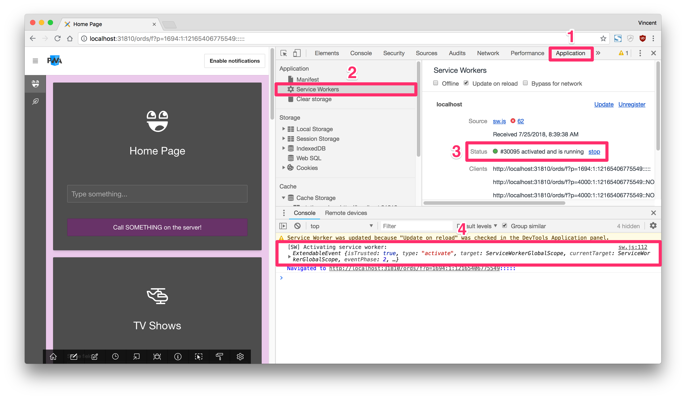
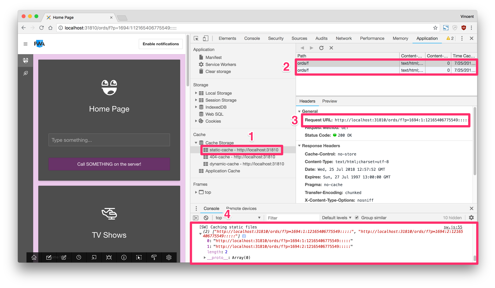
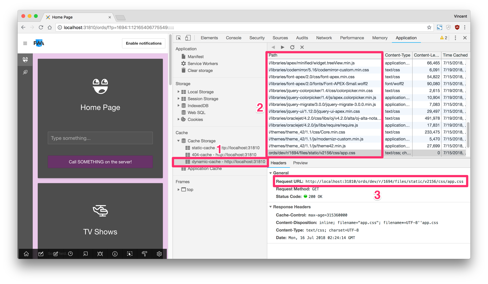

# Part 5: Using an APEX App Offline

> This blog post series intends to cover everything there is to know about turning an APEX application into a Progressive Web App.
>
> This documentation is also available [on my blog](https://vmorneau.me/apex-pwa-part5).

## APEX as a PWA: The Complete Guide

* [Part 1: Introducing PWA](./part1.md)
* [Part 2: Setup and Development Tips](./part2.md)
* [Part 3: JavaScript Recap](./part3.md)
* [Part 4: Installing an APEX App into a Mobile Device](./part4.md)
* **Part 5: Using an APEX App Offline**
* [Part 6: Handling Background Sync](./part6.md)
* [Part 7: Sending Push Notifications](./part7.md)
* [Part 8: Final Thoughts](./part8.md)

## Part 5: Table of Content

* [Characteristics](#characteristics)
* [Service Workers](#service-workers)
  * [Registering a Service Worker](#registering-a-service-worker)
  * [Installing a Service Worker](#installing-a-service-worker)
  * [Activating a Service Worker](#activating-a-service-worker)
* [Caching an APEX application](#caching-an-apex-application)
  * [Static Caching](#static-caching)
  * [Dynamic Caching](#dynamic-caching)

---

## Characteristics

Let’s make something really clear: APEX lives in the database and there is no way of embedding a Oracle Database on a phone right now. So the APEX server (the Oracle database) is still remote, and when we are offline we cannot reach the server. That truly leaves us with one only option: Caching the application.

The challenge of caching an APEX application is knowing **what** resources should be cached. As far as a PWA is concerned, we want to cache something called the _App Shell_. The _App Shell_ constitutes all necessary resources for navigating through the application without stumbling on a _404 Not Found_ error. At least, we want to be able to access all parts of our application.

From an APEX perspective, that means

* All pages (rendered HTML)
* All the static files from APEX (`desktop.min.js`, `core.min.css`, `Font APEX`, etc.)
* All custom static files (JavaScript, CSS, etc.)

That will allow us to navigate freely within an APEX application, as long as those resources have been cached.

Preview:


Observations on a regular APEX application:

* User turns off the Wi-Fi
* User navigates to another page
* Application crashes

Observations on a regular APEX PWA application:

* User turns off the Wi-Fi
* Application indicates that there is no connectivity
* User navigates to another page
* Application is still usable

To control resource caching, we have to look at service workers and the Cache API, both of which are native to web browsers and constitutes the pillars of APEX offline usage.

Some fundamental paradigms of APEX will not work properly offline, like the _Interactive Report_ or the _Interactive Grid_. I think it's fair to disable some functionalities of the app while being offline, especially those that rely heavily on server-side processing.

## Service Workers

At a very high level, a service worker is JavaScript code that originates from your application, but runs in the background of your system and continues to live there even though you have closed your browser or turned off your device.

Elevating JavaScript outside of the application has obvious perks. A service worker can intercept requests between the client and the server. That opens up a world of possibilities from an offline usage perspective, for example:

* Detecting incoming requests, cache them and deciding whether to serve from the cache or the server
* Detecting online/offline events and re-executing a stack of pending tasks
* Detecting a push notification and showing it to the mobile device
* Detecting notification click or notification close

### Registering a Service Worker

The first thing we want to do is register a service worker in our application. This allows to make the connection between our application JavaScript (Example: `#APP_IMAGES#js/app.js`) and the service worker (`./sw.js`).

As indicated in [Part 2](./part2.md), the `sw.js` file must be located at the root level of the APEX server. Example: `https://localhost:31810/sw.js`.

```javascript
/* === #APP_IMAGES#js/app.js === */

// This will contain our service worker
var apexServiceWorker = null;

pwa.init = function () {
  if ('serviceWorker' in navigator) { // (1)
    navigator.serviceWorker
      .register('/sw.js') // (2)
      .then(function (registeredServiceWorker) {
        apexServiceWorker = registeredServiceWorker;
        apex.debug.log('Service worker registered!');
      }).catch(function (err) {
        apex.debug.error('Service worker failed to register.', err);
      });
  } else {
    apex.debug.warn('Service workers are not supported by your browser.');
  }
};
```

Observations:

1. Verify if the browser supports service workers
2. Register the `sw.js` file which lies at the **root** of the APEX server

Once the service worker is registered, the APEX application can now access `sw.js`, but `sw.js` is still an empty file at this time.

### Activating a Service Worker

Let’s start with the most simple `sw.js` file possible. All it will do is listening to the `activate` event, which happens when our `app.js` invokes the service worker in the previous section.

```javascript
/* === ~/sw.js === */

self.addEventListener('activate', event => {
  console.log('[SW] Activating service worker:', event);
  return self.clients.claim();
});
```

When the service worker is activated, it should appear in the developer tools:



Observations:

1. The service worker is located in the _Application_ tab of Chrome's developer tools
2. Under _Service Workers_ section
3. Status shows _activated and running_ after our code above has run
4. Our console log statement confirms that it ran successfully

## Caching an APEX application

Caching an application is about storing resources locally. When a resource is cached (HTML, CSS, JavaScript, etc.), the browser no longer requires access to the internet to serve these resources. To do this, the service worker will leverage the Cache API, which is a native API to browsers (no external library).

One obvious advantage of caching resources is that they can be served faster than regular server resources. Not only a service worker allows offline usage, but it also increases the performance of an application.

There are two types of caching: static caching and dynamic caching. Let's review both and highlight the differences.

### Static Caching

From an APEX perspective, static caching means APEX pages. When we install the PWA, we want to fetch all pages and the associated resources and store them locally. This will be the shell of your app, or in PWA terms: the **app shell**.

We will leverage the service worker `install` event, which runs only on the first page load, which is perfect for caching the app shell, which will be stored in a special cache block named `static-cache`.

We will use the code below to achieve static caching, but make sure to change the values of `apexAppId` and `apexPages` to reflect the nature of your own APEX application. _I wish there was a way to automatically fetch all pages without explicitly defining them. Right now I think it's not possible..._

```javascript
/* === ~/sw.js === */

// The list of all APEX pages in your app
// Example: If app 1694 contains pages 1 and 2
const apexAppId = 1694; // CHANGE_ME // (1)
const apexPages = [1, 2]; // CHANGE_ME // (2)

// The following line is simplified. See the complete sw.js demo file to get the URL parsing:
// https://github.com/vincentmorneau/apex-pwa/blob/master/src/sw.js
const apexPagesUrl = parseApexPagesIntoURLs(); // (3)

self.addEventListener('install', event => { // (4)
  const cacheStatic = await caches.open('static-cache'); // (5)
  cacheStatic.addAll(apexPagesUrl) // (6)
    .then(function () {
      console.log('[SW] Caching static files', apexPagesUrl);
    })
    .catch(function (err) {
      console.error(err);
    });
});
```

Observations:

1. Change this to your own APEX application ID
2. Change this to an array containing all your APEX pages
3. See the complete `sw.js` demo file to get `parseApexPagesIntoURLs()`
4. Listening to the `install` event, which fires only the first time a user visits the application
5. Opening a cache block named `static-cache`
6. Add all APEX pages into `static-cache`

When the service worker `install` event has run, we can verify if the APEX pages have been cached properly by going into Chrome's Developer Tools, under the application tab:



Observations:

* My application (1694) has two pages (1 and 2)
* Two entries exist in the `static-cache`

### Dynamic Caching

Dynamic caching fills the gaps that the static caching is unable to cache. It relies on the service worker's `fetch` event, which intercepts **any** resources coming in from the server.

By intercepting the resource, the service worker can decide to cache the new resource and serve it from the cache or from the server.

Dynamic caching is the center of the bullseye for the service worker, and it may even be simpler to understand than static caching:

```javascript
/* === ~/sw.js === */

self.addEventListener('fetch', event => { // (1)
  const cacheRes = await caches.match(event.request); // (2)

  if (cacheRes) { // (3)
    return cacheRes;
  } else {
    const serverRes = await fetch(event.request); // (4)
    const cacheDynamic = await caches.open('dynamic-cache'); // (5)
    cacheDynamic.put(event.request.url, serverRes.clone()); // (6)
    return serverRes; // (7)
  }
});
```

Observations:

1. Listening to the service worker `fetch` event, which means there is an incoming resource
2. Verify if the incoming resource already exists in the cache
3. If the resource exists in the cache, let’s serve the resource directly from the cache
4. If the resource doesn't exist in the cache, fetch the resource from the server
5. After serving the resource from the server, open the `dynamic-cache`
6. Save the resource in the cache
7. After the resource has been cached, serve the resource to the user

The `fetch` event can be triggered dozens of times on the first page load. It will cache all necessary JavaScript, CSS, and other libraries. We can see the dynamic resources here:



---

We've made a step in the right direction by making the APEX application _viewable_ offline. In the next [Part 6: Handling Background Sync](./part6.md) we will see how we can make it usable, in terms of posting data to the server when connectivity comes back.

_Think this documentation can be enhanced? Please open a pull request and fix it!_
