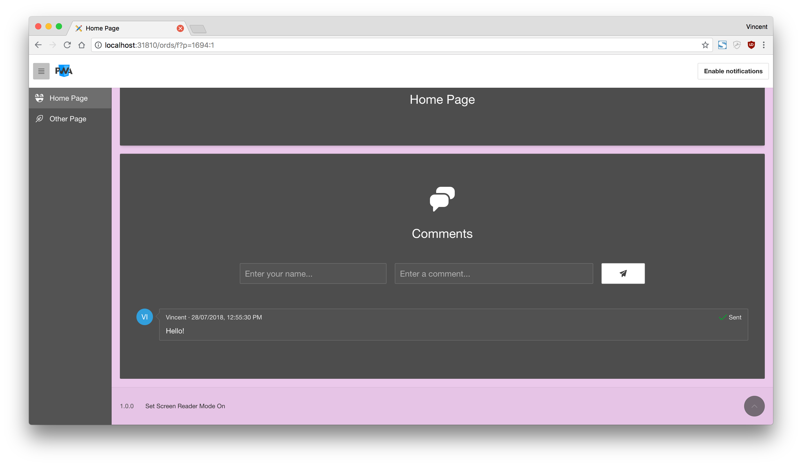
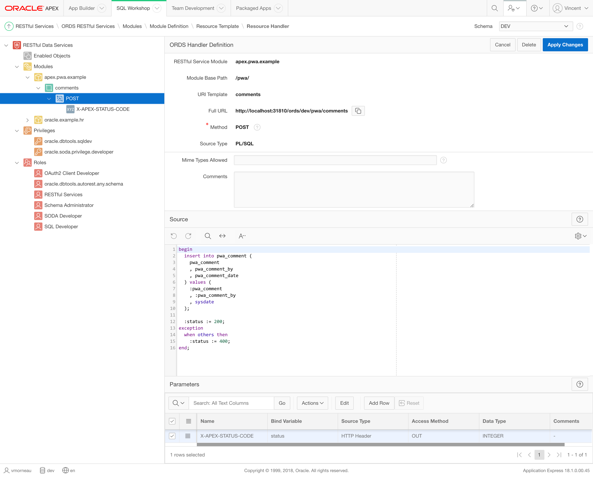

# Part 6: Handling Background Sync

> This blog post series intends to cover everything there is to know about turning an APEX application into a Progressive Web App.
>
> This documentation is also available [on my blog](https://vmorneau.me/apex-pwa-part6).

## APEX as a PWA: The Complete Guide

* [Part 1: Introducing PWA](./doc/part1.md)
* [Part 2: Setup and Development Tips](./doc/part2.md)
* [Part 3: JavaScript Recap](./doc/part3.md)
* [Part 4: Installing an APEX App into a Mobile Device](./doc/part4.md)
* [Part 5: Using an APEX App Offline](./doc/part5.md)
* **Part 6: Handling Background Sync**
* [Part 7: Sending Push Notifications](./doc/part7.md)
* [Part 8: Final Thoughts](./doc/part8.md)

## Part 6: Table of Content

* [Characteristics](#characteristics)
* [Listening to Online/Offline Events](#listening-to-online-offline-events)
* [Getting Current Online/Offline Status](#getting-current-online-offline-status)
* [IndexedDB](#indexed-db)
* [Storing Data When Offline](#storing-data-when-offline)
* [Displaying Pending Data](#displaying-pending-data)
* [Submitting Data When Back Online](#submitting-data-when-back-online)
* [Refreshing the UI When Back Online](#refreshing-the-ui-when-back-online)

---

## Characteristics

[Part 5](./doc/part5.md) was a great first step which allows to view an application while being offline, but in the context of an APEX application I would argue that it's not useful enough if we can't save anything. Background sync is the concept we will explore to keep using the functions of our APEX application.

Since we can't reach the server when we are offline, the idea of background sync is to temporarily store data as persistent storage, then resubmit it to the server when the network is back. Persistent storage means that the data persists even if you refresh, leave the app or close the browser so that makes it really powerful when talking about mobile usage, where you don't necessarily have the application opened when the network is back. We will be leveraging the IndexedDB API and the Sync API for that.

Preview:


Observations:

* User is online
* User submits a form (name and comment), data gets saved in the database
* User turns off the Wi-Fi
* User submits the same form again, data appears as pending and is not saved in the database
* User turns on the Wi-Fi
* Data is automatically resubmitted and saved in the database
* Report is automatically refreshed

## Listening to Online/Offline Events

Let’s start with something really simple: knowing when a user has lost connection and when he's regained connection.

Browsers give us two events to listen to:

```javascript
/* === #APP_IMAGES#js/app.js === */

window.addEventListener('online', function() {
  apex.message.showPageSuccess('You are back online!');
});

window.addEventListener('offline', function() {
  $('#t_Alert_Success').remove();
  apex.message.clearErrors();
  apex.message.showErrors([{
    type: 'error',
    location: 'page',
    message: 'You have lost connection <span aria-hidden="true" class="fa fa-frown-o"></span>'
  }]);
});
```

When the online event has fired, we want to display a success message indicating that the connection is back. When the offline event has fire, we want to display a warning message indicating that the connection is lost.

When going offline, perhaps an interesting idea to be to disable _Interactive Report_ and _Interactive Grid_ search bars. These APEX mechanisms inevitably calls the server and there is no way around that so it would be better to disable them. The demo in this GitHub repository does not include such disabling feature.

## Getting Current Online/Offline Status

Now we know at the moment the user goes online or offline, but it would also be useful to know the connection status at any given time. The following code shows how to detect the current online/offline status:

```javascript
if (navigator.onLine) {
  // Do something when user is online
} else {
  // Do something when user is offline
}
```

Further down, we will see how to handle an APEX process when the user is offline.

## IndexedDB

IndexedDB is a browser API for client side persistent storage. It can store JSON data, blobs or files and other format types. It has to ability to query data (SQL-like).

More importantly, it works with client side JavaScript **and** with service workers, so it’s a very efficient way to communicate between the app and the service worker. We must remember that it is the service worker that will eventually resubmit the data when the connection comes back. The user might not be in the app at that time and this is why the service worker must communicate with the app.

IndexedDB is native to browsers, but in this demo we will be using [localForage](https://localforage.github.io/localForage/), which is a wrapper around IndexedDB and provides a simpler API.

Here's how we will be using the API:

```javascript
// Configure our database name
localforage.config({
  name: 'pwa-offline-tasks'
});

// Add a new task
localforage.setItem('pwa-offline-task-1', 'something');

// Loop through all tasks
localforage.iterate(function (value, key) {
  // Do something with this task
  console.log(key, value); // 'pwa-offline-task-1', 'something'
});

// Clear our database
localforage.clear();
```

## Storing Data When Offline

This is where it gets interesting. There is very important shift in the paradigm of APEX development here. In order to resubmit data to the server when connectivity comes back, all back-end process must be exposed as web services. When the user is offline, the reference to the web service can simply be stored in the IndexedDB, which will be invoked by the service worker later on.

This concept is better illustrated in an example. We will demonstrate background sync with a simple application used for adding comments to a list:



On that application, we have the "Send" icon button that invokes the follow function: `pwa.p1.addComment()` and it passes the values of the two text fields. This function will call a RESTful web service, defined in ORDS at `/ords/dev/pwa/comments`

```javascript
/* === #APP_IMAGES#js/app.js === */

pwa.p1 = {
  /**
   * @function addComment
   * @example pwa.p1.addComment();
   **/
  addComment: function (apexPwaComment, apexPwaCommentBy) {
    // REST endpoint in ORDS that contains the logic for adding a comment
    // (1)
    var endpoint = '/ords/dev/pwa/comments';
    var options = {
      method: 'POST',
      headers: {
        'Content-Type': 'application/json'
      },
      body: JSON.stringify({
        pwa_comment: apexPwaComment, // Passing the comment value
        pwa_comment_by: apexPwaCommentBy // Passing the comment by value
      })
    };
    // ID of the comment report region, used to refresh the report later
    var refreshReportId = 'comments-report';

    // Check if the user is online (2)
    if (navigator.onLine) {
      fetch(endpoint, options)
        .then(function (data) {
          apex.region(refreshReportId).refresh();
        }).catch(function (err) {
          console.error('Adding comment failed.', err);
        });
    } else { // (3)
      localforage.config({
        name: 'pwa-offline-tasks'
      });
      localforage.setItem(uuidv4(), { // (4)
          endpoint: endpoint,
          options: options,
          refreshReportId: refreshReportId
        })
        .then(function (data) {
          console.log('Saved offline task successfully.', data);
          // Register the sync event on the service worker
          apexServiceWorker.sync.register('pwa-offline-tasks'); // (5)
        }).catch(function (err) {
          console.error('Setting offline tasks failed.', err);
        });
      }
    }
  }
};
```

Observations:

1. Defining all the REST necessary values (endpoint, REST options, data to send)
2. User is online, so simply invoke the web service
3. User is offline, so we need to save the task for when connectivity comes back
4. Add the current pending task to the IndexedDB. `uuidv4()` is a function to generate a unique ID to the current pending task.
5. Tells the service worker that there is now a pending task to be executed when connectivity comes back. More on this later.

As a reference, here's the REST module used at `/ords/dev/pwa/comments` above:



## Displaying Pending Data

When the user is offline, the data has been saved in the IndexedDB, but it isn't saved in the database yet, so APEX can't render on the record on the report.

A interesting pattern would be to append the new record temporarily on the page. After the pending task has been added to the IndexedDB, we could use this:

```javascript
/* === #APP_IMAGES#js/app.js === */

$("#" + refreshReportId + " .t-Comments").prepend(
  apex.util.applyTemplate(
    '<li class="t-Comments-item">' +
    '<div class="t-Comments-icon a-MediaBlock-graphic">' +
    '<div class="t-Comments-userIcon u-color-15" aria-hidden="true">#USER_ICON#</div>' +
    '</div>' +
    '<div class="t-Comments-body a-MediaBlock-content">' +
    '<div class="t-Comments-info">#USER_NAME# &middot;<span class="t-Comments-date">#COMMENT_DATE#</span>' +
    '<span class="t-Comments-actions">#ACTIONS#</span>' +
    '</div>' +
    '<div class="t-Comments-comment">#COMMENT_TEXT#</div>' +
    '</div>' +
    '</li>', {
      placeholders: {
        USER_ICON: apexPwaCommentBy.substring(0, 2).toUpperCase(),
        USER_NAME: apexPwaCommentBy,
        COMMENT_DATE: new Date().toLocaleString(),
        ACTIONS: '<span aria-hidden="true" class="fa fa-spinner fa-anim-spin u-warning-text"></span> Waiting on connection',
        COMMENT_TEXT: apexPwaComment
      }
    }
  )
);
```

This would allow to get a nice looking indicator that the latest comment is still pending and will be saved the connectivity comes back:


## Submitting Data When Back Online

After the task has been saved in the IndexedDB and registered in the service worker, the user can navigate elsewhere, close the browser or even close the device.

The service worker will take care of reanimating the process from there on.

```javascript
/* === ~/sw.js === */

self.addEventListener('sync', event => {
  console.log('[SW] Syncing', event);
  event.waitUntil(syncSW(event)); // (1)
});

/**
 * @function syncSW
 * Executes a list of offline tasks when the service worker detects connectivity is back
 **/
async function syncSW(event) {
  // This example handles a sync task called pwa-offline-tasks
  if (event.tag === 'pwa-offline-tasks') {
    const tasks = [];
    const refreshReportIds = [];

    // Configure the IndexedDB to use pwa-offline-tasks database
    localforage.config({
      name: 'pwa-offline-tasks'
    });

    // Looping through all tasks in the pwa-offline-tasks database (2)
    localforage.iterate(function (value, key, iterationNumber) {
      tasks.push(fetch(value.endpoint, value.options)); // (3)
      refreshReportIds.push(value.refreshReportId); // (4)
    }).then(function (data) {
      Promise.all(tasks) // (5)
        .then(function (data) {
          console.log('[SW] Offline tasks sync succeeded.', data);
          // Refresh APEX reports
          broadcastRefresh(refreshReportIds); // (6)
          // CLear the IndexedDB
          localforage.clear();
        }).catch(function (err) {
          console.error('[SW] Offline tasks sync failed:', err);
        });
    }).catch(function (err) {
      console.error('[SW] Iterate through offline tasks failed:', err);
    });
  }
}
```

Observations:

1. The service worker will fire the process only after connectivity comes back
2. This will loop through all pending tasks in the IndexedDB
3. Building an array of all tasks that need to be relaunched after connectivity comes back. `Fetch` will trigger the REST call again, with the same endpoint, options and data as the moment it was originally triggered
4. Building an array of all reports that need to be refreshed after connectivity comes back
5. Invoking all REST calls
6. Sends a flag to the browser so that APEX can refresh the report again

## Refreshing the UI When Back Online

The user may not be watching the app when the connectivity comes back, but if he is, there needs to be some sort of indicator that the data has been refreshed.

We will achieve this by broadcasting from the service worker to the browser, after every pending tasks have been executed:

```javascript
/* === ~/sw.js === */
broadcastRefresh(refreshReportIds);

/**
 * @function broadcastRefresh
 * Broadcasts a message to the client, which allows to refresh reports
 * after data has been saved
 **/
function broadcastRefresh(refreshReportIds) {
  self.clients.matchAll().then(function (clients) {
    clients.forEach(function (client) {
      client.postMessage({
        refreshReportIds: refreshReportIds
      });
    });
  });
}
```

Back to `app.js`, we will add an event listener on the `message` event from the service worker. By receiving a list of report IDs, we are able to refresh all relevant reports:

```javascript
/* === #APP_IMAGES#js/app.js === */

// Receiving a message from the service worker
navigator.serviceWorker.addEventListener('message', function (event) {
  // Check if there are any reports to refresh
  if (event.data.refreshReportIds) {
    // Loop in the reports to refresh
    for (var key in event.data.refreshReportIds) {
      if (event.data.refreshReportIds.hasOwnProperty(key)) {
        // Refresh a report
        apex.region(event.data.refreshReportIds[key]).refresh();
      }
    }
  }
});
```

After the service worker has sent the message, APEX is able to refresh the report. In our example, it would finally look like this:


---

Now we can finally use an APEX application offline! While the example was basic, it covered most of the technicalities around background synchronization. By adapting the code above, you should be able to make your own application offline-ready. Let's head to [Part 7: Sending Push Notifications](./doc/part7.md) for the final chapter on PWA features.

_Think this documentation can be enhanced? Please open a pull request and fix it!_
